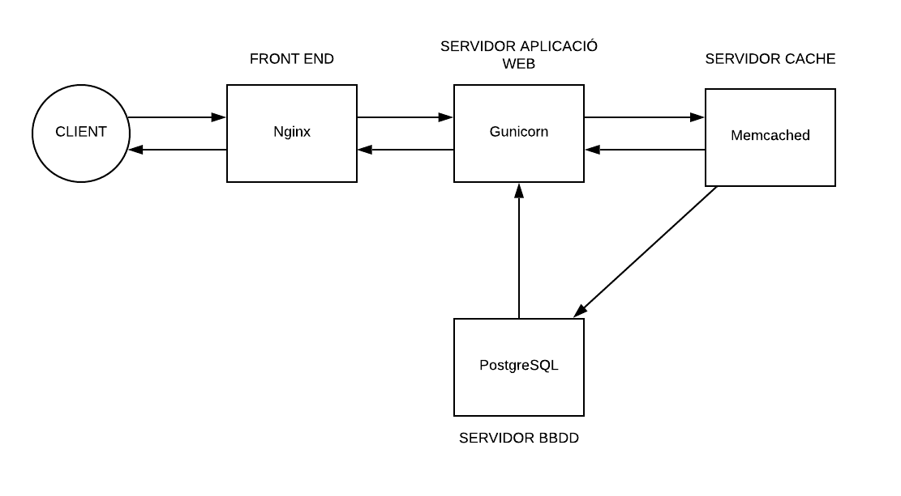

# Proposta deploy

Per tal de fer un desplegament de l'aplicació seguint l'explicació del punt 5 de l'enunciat, s'ha decidit fer una proposta de 4 capes:

1. **Servidor web FrontEnd** 
Servidor NGINX que s'encarregaria de gestionar les peticions web realitzades pels diferents clients i filtrar-les. Un cop rebudes les peticions, aquestes són comunicades a la capa del servidor de l'aplicació.

2. **Servidor Aplicació web**
En aquest servidor es trobaria el motor de l'aplicació, en aquest cas gunicorn. S'encarregaria d'executar l'aplicació desenvolupada mitjançant Django. A més a més, per tal de millorar la seguretat, es limitaria la conectivitat d'aquest al servidor de FrontEnd, el servidor de la BBDD i el servidor cache. Per tal d'obtenir les dades, aquest servidor es comunicaria amb el servidor cache.

3. **Servidor cache**
Aquest servidor empraria el sistema memcached i s'encarregaria d'emmagatzemar en cache les dades més emprades per l'aplicació per tal de poder alleugerir la càrrega al servidor de la BBDD. En cas que aquest servidor tingués emmagatzemades les dades necessàries per atendre la petició, seria aquest el que les donaria. En cas contrari, les dades disponibles les retornaria aquest servidor i les dades mancants, serien consultades al servidor de la BBDD i seria aquesta les que les retornaria.

4. **Servidor BBDD**
El servidor de BBBDD en aquest cas es tractaria d'un servidor postgreSQL. Aquest emmagatzemaria totes les dades de l'aplicació de forma persistent.

